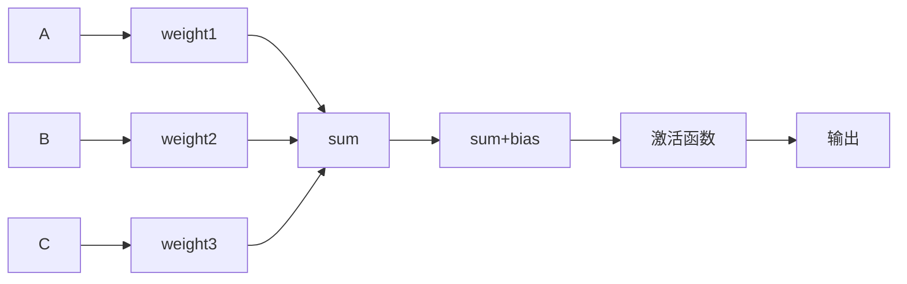
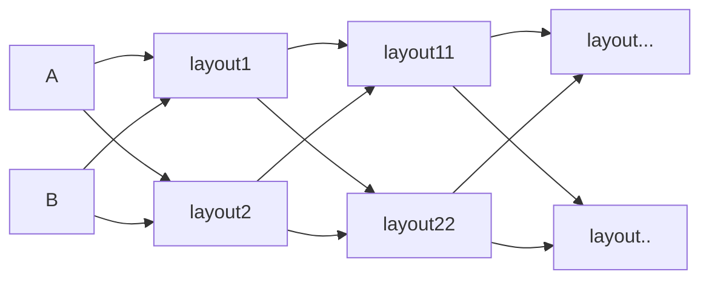

# Neural Network

## Neuron

Fully Connect Feedforward Network

# CNN

卷积是将一些数线性加权起来，卷起来

- padding：填充，需要决定怎样进行填充
- stride：步长，就是一次所移动的位置量
- pooling：max pooling

根据stride+filter进行卷积，进行pooling（可能使用max polling）生成新的图像，经过多次的stride+filter  & pooling 之后，生成一个全连接的神经网络，最后输出特征。

# RNN

循环神经网络

# python相关库

## tensorflow

## theano

## keras

- 更改backend `import os; os.environ('KERAS_BACKEND')='theano';import keras`
- `ERROR: Unable to create the compiledir directory...check the permissions`， solve：`cd ~; sudo rm -r .theano` 
- ​