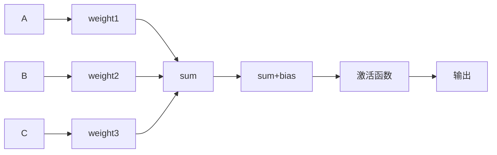
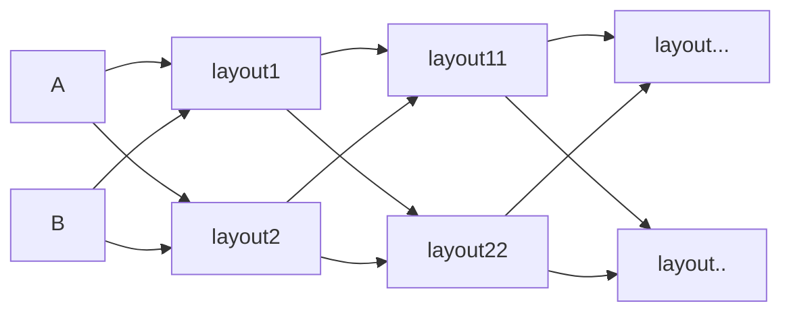

# Neural Network

## Neuron

```mermaid
graph LR
A --> weight1
B --> weight2
C --> weight3
weight1 --> sum
weight2 --> sum
weight3 --> sum
sum --> sum+bias
sum+bias --> 激活函数
激活函数 --> 输出
```

Fully Connect Feedforward Network

```mermaid
graph LR
A --> layout1
A --> layout2
B --> layout2
B --> layout1
layout1 --> layout11
layout1 --> layout22
layout2 --> layout11
layout2 --> layout22
layout11 --> layout...
layout11 --> layout..
layout22 --> layout..
layout22 --> layout...
```

# CNN

卷积是将一些数线性加权起来，卷起来

# RNN

循环神经网络

