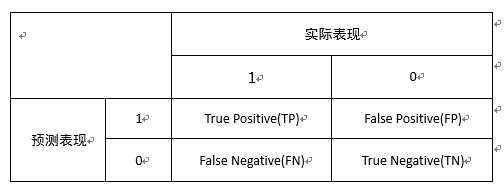
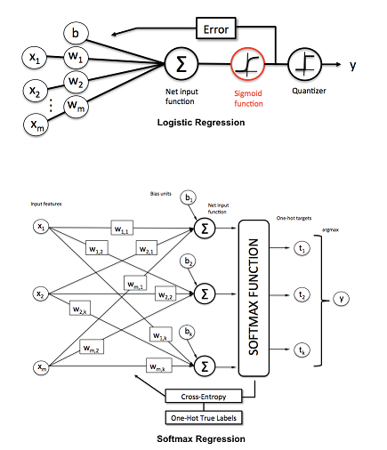

## 统计学习三要素

统计模型的三要素：模型+策略+算法

## 模型评估和模型选择

### 过拟合和模型选择

过拟合是指学习时选择的模型所包含的参数过多，以至于出现这一模型对于已知数据预测的好，但是对于未知数据预测的差的现象。解决过拟合的方案是正则化和交叉验证。

## 正则化与交叉验证

### 正则化

- L1范数：得到稀疏的权值？。e.g. LASSO
- L2范数：得到平滑的权值？。e.g. Ridge Regression

### 交叉验证

就是将数据分为训练集和测试集

## 泛化能力

Error = bias + variance + noise

模型搞得复杂，参数多，才能低偏差，模型简单，参数少，才能低方差，[偏差和方差](https://www.zhihu.com/question/20448464), 简单讲偏差是距离目标值的接近程度，方差是预测值的变化范围，预测值与预测值之间的变化程度

## 生成模型与判别模型

### 生成模型与判别模型

生成模型是使用联合概率密度计算，判别模型是使用条件概率密度进行计算。为什么朴素贝叶斯和HMM，？？？混合高斯模型是生成模型，而KNN，逻辑回归是判别模型

- 常见的生成模型：朴素贝叶斯和HMM，混合高斯模型

- 常见的判别模型：KNN，感知机,CRF,逻辑回归，SVM，最大熵模型

## 分类问题的判定标准

举例：以某借款的逾期预测模型为例，这是一个有监督的二分类模型，模型对每个样本的预测结果为一个概率值，我们需要从中选取一个阈值来区分好用户和坏用户。

精确率（precision）：TP/(FP+TP), 预测为坏人的情况中，预测正确的（实际为坏人）的人的占比 

召回率（recall）：TP/(TP+FN), 实际为坏人的情况中，预测正确的（预测为坏人）的人的占比

F1值：准确率与召回率的调和均值

ROC曲线：ROC是多个混淆矩阵的组合结果。首先一点我们不定好**阀值**，而是将模型的预测结果从高到低进行排序，将每个概率值依次作为阀值，那么就有多个的混淆矩阵。对于每个混淆矩阵，计算TPR（True positive rate）和FPR(False positive rate), TPR = TP/(TP+FN)=Recall, 也就是召回率，FPR=FP/(FP+TN), 我们以FPR为x轴，以TPR为y轴，就得到了ROC曲线

AUC曲线：（area under curve）的值为ROC曲线下面的面积，AUC的值越高， 模型的区分能力越好

Gini系数：Gini系数与AUC所表示的意义相同，只是计算方式不同，GINI系数（经济学）是指ROC曲线与中线（上图红线）围成的面积和中线（上图红线）之上的面积（0.5）的比例

# 随机森林

因为单个决策树容易出现过拟合的现象，所以就将这些树合起来（bagging思想）构成了随机森林

集成的两种方法比较

bagging：是采用的有放回的均匀抽样，所以能够并行化处理
boosting：根据错误率进行取样，对每次失败的案例赋予较大的权重

## 生成过程

1. bootstap过程：有放回的抽样
2. 对每个样本中M个特征中提取出m个特征，每次树进行分裂的时候，从m个特征中选择最优的
3. 每棵树尽可能的生长，不进行剪枝

第一步和第二步确保了随机森林随机性，所以避免出现过拟合的现象

## 优缺点：

优点：不容易出现过拟合(这里可能问why)，可以得到变量的重要性排序（怎样进行排序），容易进行并行化（bagging的优点）

缺点：在噪声比较大的数据上，可能出现过拟合的现象（改进的办法是什么）

# 逻辑回归与softmax回归

logistic 回归模型与softmax回归可以看成最简单的神经网络模型，没有隐藏层

1. $$ z= W^{T}x+b$$
2. $$ \hat{y} = \sigma(z)$$
3. sigmod函数 $$ \sigma(x) = \frac{1}{1+\exp(-x)}$$

# 支持向量机(SVM)

## 概述

- 训练数据线性可分时，硬间隔最大化，线性可分支持向量机
- 训练数据近似线性可分时，软间隔最大化，线性支持向量机
- 训练数据线性不可分时，使用核技巧和软间隔最大化，非线性支持向量机

支持向量机的思想：找到几何间隔最大的超平面这也就意味着不仅仅是将正负的实例点分开，而且距离超平面最近的点也有足够大的确信度使他们分开。（那么对于每个的点也是如此，这在约束条件中有展现）

## 线性可分支持向量机

## 线性支持向量机

## 非线性支持向量机

### 核函数

核函数本质上讲就是函数的内积，这是一种计算技巧，使得计算更为简单

### SVM 核函数

- 多项式核函数
- 高斯核函数
- 字符串核函数
- 径向基核函数（RBF）
- sigmoid核函数
- 拉普拉斯核函数

SVM的参数主要有两个，一个RBF函数的kernel的参数，一个是惩罚系数

# 提升方法

## 提升方法与集成方法

ensemble就是把几种机器学习的算法组合在一起或者是把一种算法的不同参数组合到一起，基本分类为bagging和boosting。bagging的典型代表是随机森林（将样本进行bootstap取样，每一部分进行决策树，然后组合起来）, boosting的典型代表是GBDT和xgboost

boosting的典型思想是对一份数据建立m个模型，每次分类将上一次分错的数据的权重提高一点再进行分类，最后将所有的模型组合起来，比如我做练习题，这个题目一部分练习题做错了，然后下次我做题的时候就把时间多分配到这部分做错的题目上，下下次我就将把时间更多的分配到两次都做错的题目上

## GBDT

GBDT(Gradient Boosting Decision Tree) 又叫 MART（Multiple Additive Regression Tree)，是一种迭代的决策树算法，该算法由多棵决策树组成，所有树的结论累加起来做最终答案。它在被提出之初就和SVM一起被认为是泛化能力较强的算法。
GBDT中的树是回归树（不是分类树），GBDT用来做回归预测，调整后也可以用于分类。

## 提升树

## XGBoost

# EM算法

[直观的理解EM算法](http://www.jianshu.com/p/1121509ac1dc)

# 隐马尔可夫（HMM）

## 发展过程

HMM经常表示时序问题（https://en.wikipedia.org/wiki/Viterbi_algorithm）

- HMM - MEMM (最大熵马尔科夫模型) - CRF
## Why（wiki）

假设你有一个住得很远的朋友，他每天跟你打电话告诉你他那天做了什么。你的朋友仅仅对三种活动感兴趣：公园散步，购物以及清理房间。他选择做什么事情只凭天气。你对于他所住的地方的天气情况并不了解，但是你知道总的趋势。在他告诉你每天所做的事情基础上，你想要猜测他所在地的天气情况。

你认为天气的运行就像一个[马尔可夫链](https://zh.wikipedia.org/wiki/%E9%A9%AC%E5%B0%94%E5%8F%AF%E5%A4%AB%E9%93%BE)。其有两个状态"雨"和"晴"，但是你无法直接观察它们，也就是说，它们对于你是隐藏的。每天，你的朋友有一定的概率进行下列活动："散步", "购物"，或"清理".因为你朋友告诉你他的活动，所以这些活动就是你的观察数据。这整个系统就是一个隐马尔可夫模型HMM.

你知道这个地区的总的天气趋势（今天下雨明天下雨的概率，今天下雨明天晴天的概率），并且平时知道你朋友会做的事情。

注意：只有观测序列时而没有状态序列时是采用的EM算法。

## What ?

## How?

HMM 有三个典型(canonical)问题（wiki）

### 预测：

已知模型参数和某一特定的输出序列，求最后时刻各个隐含状态的概率分布，通常使用前向算法解决

### 平滑

已知模型参数和某一特定数序序列，求中间时刻的各个隐含状态的概率分布，通常使用前向后向算法。

### 解码

已知模型参数，寻找最可能产生某一特定输出序列的隐含状态的序列，通常使用维特比算法进行解决。[维特比算法的动态图](https://en.wikipedia.org/wiki/File:Viterbi_animated_demo.gif)

另外已知输出序列，寻找最可能的状态转移及输出概率，通常使用B-W算法以及反向维特比算法。

## 概率计算方法

### 直接计算法

### 前向算法

### 后向算法

### 一些概率值和期望值的计算

## 学习算法

### 监督学习算法

### Baum—Welch算法

### B-W算法的参数估计公式

## 预测算法

### 近似算法

### 维特比算法

维特比算法是一种动态规划算法。(动态规划算法与贪婪算法的区别)

# 常见算法的优缺点

1. SVM的优缺点：

优点：小样本，非线性，高维问题中有很多的优势
缺点：对于缺失值比较敏感

# 

## k-means

# 时间序列分析

# 问题归类

##  常见的降维方法

- LASSO，聚类，PCA，小波分析，线性判别，拉普拉斯特征映射

# 梯度下降法

## [Why](http://blog.csdn.net/coder_oyang/article/details/46544089)

y = x^2 求出y的最小值

## What

求解无约束最优化的问题

## How

### python 实现
