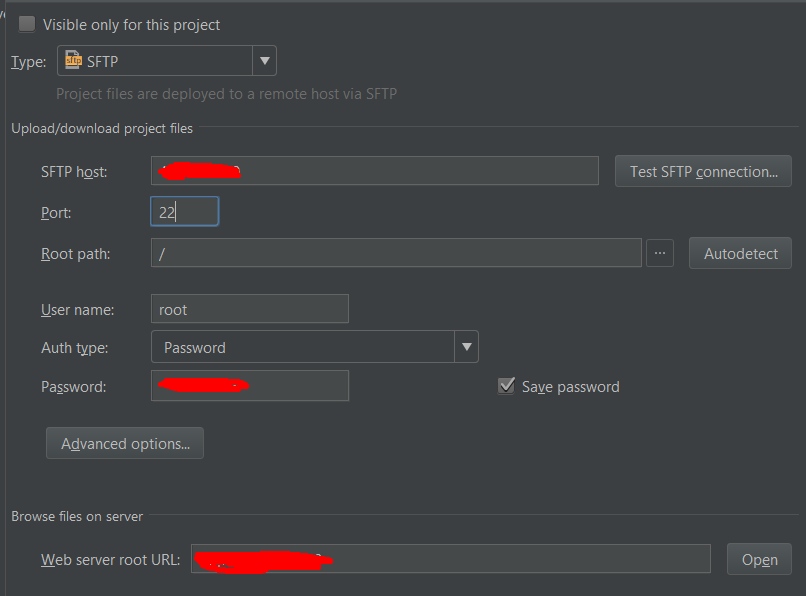
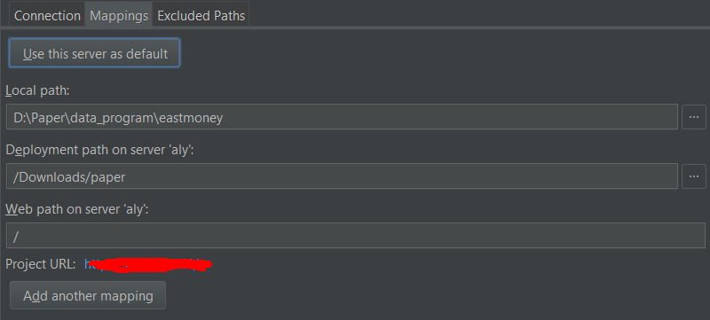

# 基础知识

## 规范

### 规范

- 装饰器中使用functools 中的@wraps(func)
- 类的命名：驼峰命名法
- 函数的命名：
- 函数一定要添加注释。这一部分使用详见pycahrm
- TODO的使用，这一块在pycharm很好用
- 不做没有意义的命名，尤其是t，x，y，就像文件的命名一样
- python正则表达式使用 r' '  不需要在用\进行转义了，首先用字符串提供的常见函数看能否进行解决，然后再考虑用正则表达式
- 使用super初始化父类
- 头部文件加入编码字符
- 构建项目时尽量使用虚拟环境，virtualenv

###  VCS

## 数据类型
字符串的常用函数：
- 去掉空格,去掉首尾空格，strip() 函数，
- 分隔字符串：split()，注意使用s.split()与s.split(" ")是不相同的，前面的使用方法更好一些
- 拼接字符串：join函数，使用join函数而不是“+”
- 统计某个字符出现的次数：count()
- 字符串处理：转换为大写 upper()，转换为lower()
- 替换字符串：str.replace()
- 前缀后缀：startwith, endwith
- 字符串是否包含：find, in, index
- 指定分隔符进行分隔：partition

常用的逻辑运算符：

常用的列表函数：

- append函数
- extend函数，extend函数很有用处，尤其是你写出[[a,b,c],[a,f,g]]这种list时，有必要用extend函数进行改写
- 使用enumerate进行循环取值。

其他常见的内置函数

- isinstance(s,(str,int))  判断第一个字符是不是后面的实例
- any，all表示函数中的不为0，False，''的元素，

## iterator 

common usage of `while`

```python
init_status = True
while i < num:
  if num % i == 0:
    init_status = False
    break
  i += 1	
```


## python数据结构与算法

- list 本质上是数组，而不是链表,数据访问很快，但是插入和删除元素就很慢了。时间复杂度为O(n)
- collections中的deque是双向链表
- collections中的queue是单向链表
- set和dict的底层是一个hash表，时间复杂度为O(1)

## 函数

### 函数的参数

### Recursion func

Fib  function

```python
def fib(n):
  	if n < 2: return 1
    return fib(n-1) + fib(n-2)
```

The improved Fib function (the Fib function + standard dict + decorator)

```python
from functools import wraps

def decorator(func):
	cache = {}
 	@wraps(func)
  	def wrapper(*args):
		if args not in args:
      		cache[args] = func(*args)
    	return cahce[args]
     return wrapper
  
@decorator
def fib(n):
  	if n < 2: return 1
    return fib(n-1) + fib(n-2)
```

#### 参考资料

[递归转迭代](http://blog.moertel.com/posts/2013-05-11-recursive-to-iterative.html)

[recursion to iteration part1-part4](http://blog.moertel.com/)

## Functional progrmming

### Higher-order function

- map, filter ( *recommend to use list comprehension*)
- reduce
- sorted（notice the parameter *key*  like *min* function）

Implementation of recude function

Simple implementation of reduce function

```python
def reduce_test(func,str_list):
    m = 0
    for i in str_list:
        m += func(m,i)
    print m
```

```python
def reduce(function, iterable, initializer=None):
    it = iter(iterable)
    if initializer is None:
        try:
            initializer = next(it)
        except StopIteration:
            raise TypeError('reduce() of empty sequence with no initial value')
    accum_value = initializer
    for x in it:
        accum_value = function(accum_value, x)
    return accum_value
```


### Closure

- 背景：python中尽量不要使用全局变量，通过闭包可以获得外部函数的参数

### lambda func

### Decorator

- 问题1：类中的装饰器如何写？[类中装饰器](https://medium.com/@vadimpushtaev/decorator-inside-python-class-1e74d23107f6)

### partical function

## OOP

## 面向对象高级编程

## 错误调试测试

## IO编程

### 文件读写

```python
import chardet
with open('path.txt','rb') as f:
	data = f.read(1000)
    print(chardet.detect(data))
#判断文件的编码格式，此时'rb'参数不需要添加errors参数
```


注意这里with的用法是上下文管理器的用法。有关详情参见contextlib，问题为什么没有mysql等数据库的连接中没有使用上下文管理器。

### 操作文件

## 进程和线程

## 常用模块

### sys
1. 当不确定有多少行输入

  ```python
  import sys
  a = []
  for line in sys.stdin:
  	if line.strip() == '':
  		break
  	a.extend(line.split())
  print len(set(a))
  ```

  最后的print 不一定使用，因为是在linux运行的，因此输入完成时使用ctrl+D在win下面是无法退出的。

2. 当有确定的行数输入时
  使用raw_input()
  s=[int(i) for i in raw_input().split(',')]
  这边还要考虑的一个问题是过滤的问题，例如s.split分割中的None，标点符号，空格等等

### re

### logging

| 重要概念      | 定义   | 解释                     |
| --------- | ---- | ---------------------- |
| Logger    | 记录器  | 实例  暴露了应用程序代码能够直接使用的接口 |
| Handler   | 处理器  | 将记录器产生的日志发送到合适的目的地     |
| Filter    | 过滤器  | 据诶的那个输出哪些日志记录          |
| Formatter | 格式化器 | 日志记录的布局                |

## advanced

### Template

```python
from string import Template
```

### Argparse

主要作用命令行参数的设置

### PyQt4

安装

- windows安装：windows exe安装包
- ubuntu安装：sudo apt-get install python-qt4
- centos安装：yum install PyQt4

## 其他
### python chr(), ord(), unichr() 函数

###  虚拟环境的使用建议使用conda进行安装

- 建议先更改conda 的源文件：

- ```
  conda config --add channels https://mirrors.tuna.tsinghua.edu.cn/anaconda/pkgs/free/
  conda config --set show_channel_urls yes
  ```

- 利用conda  config 在本地会生成.condarc的隐藏文件，win下面C:\user\用户名

- conda create -n tensorflowpy python==3.6.2  就是创建了名为tensorflowpy的虚拟环境

- win下activate tensorflowpy 

- 在虚拟环境中可以使用conda与pip进行安装（不限于网络,whl进行安装）

### 安装

speech_recognition中的安装pyaudio中portaudio错误

- https://stackoverflow.com/questions/5921947/pyaudio-installation-error-command-gcc-failed-with-exit-status-1


## python帮助

help函数

## Effiency
- 决定整体效率的是最高层次是整体框架，第二个是代码水平和算法水平，第三个才是语言
- python的开发效率高，但是运行的慢这是不争的事实

提高效率的方法
- 优化自己的算法，计算机的数据结构和算法
- 使用cprofile找到python的性能瓶颈在哪里
- 减少冗余数据，能用稀疏矩阵的尽量用稀疏矩阵


other

- pypy, CPython, Jython  [the link](https://www.zhihu.com/question/20005950)

## numpy

pandas

- 将df重新转化为字典形式：`dict(zip(df.columns,df.T.values.tolist))`

# IDE(集成开发环境)

## Jupyter

## jupyter 快捷键

- 调用帮助 esc + H
- 打开命令面板 esc+p
- 注意使用jupyter中，尽量生成两个窗口，一个是jupyter一个是 搜索


```python
%lsmagic
## 魔术方法
```

注：几个问题
- nbextensions 的navigation hot_keys后，使用esc可能受到限制
- nbextensions 中的tables of content 不能够折叠
- vim和nbextensions  存在一定的冲突，不能很好的进行选定

## pycharm

### Pycharm  专业版激活

### python 解释器

- 远程连接 
    - Tools -> Deployment -> configure

      

      ​

    - 

    - ctrl+alt+shift+x 将本地文件同步至服务器

    - 自定义快捷键alt+x 和服务器文件进行比较

    - ctrl+D 可以和本地文件夹进行批量比较

### 代码重构 ？？

### VCS


### 数据库插件

- mongo  view -> tool buttons
- databse  navigate  : sqlie3 是linux自带的

### pycharm 快捷键（已经掌握的不再列出)

- ctrl + J 代码提示，直接输入main可以得到 if __name__ == '__main__':
- ctrl + shift + -  代码收缩
- ctrl + shift + [ 迭代代码开始。ctrl+ shift +] 迭代代码结束
- Alt+对应的字母或者是数字,esc 返回编辑器窗口,
- 常用 alt+1 文件结构，alt+6 todo
- 双击 shift 进行快速搜索
- 一直按住ctrl，然后按tab进入转换器，此时按相应按键  T 进入 Terminal,这里用ctrl+E  键入搜索来代替
- ctrl+E进行搜索
- ctrl+F4 关闭标签页
- ctrl+F5 重新运行
- ctrl+F2 stop这个程序
- alt+shift+F9 用来代替shift+F10
- shift + esc 配合  pgup pgdn 和 ctrl+g 进行快速定位
- ctrl+y 删除一行
- ctrl+g 快速定位到某一行
- ctrl+shift+F4  关闭debug的多窗口
- 批量缩进其实是ctrl+G 快速定位到某行，然后进行键入 try: 利用格式化进行缩进，而不是选定某一行
